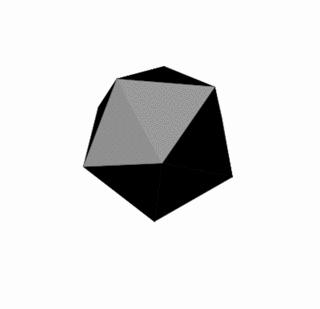

# Crystal-programming-language-presentation

  
  

This is a presentation about the Crystal programming language made in [reveal.js](https://revealjs.com/).

## Technologies used

## How to run

1. navigate to the root directory of the project. it contains all the dependencies the presentation needs to load the slides

2. open the index.html file in your browser where you will be presented with the landing page of the presentation (chrome is recommended)

## Basic  slide navigation

1. the table of contents contains clickable links to the slides

2. you can use keyboard arrows to navigate the slides as well as the mouse to click on the arrows on the screen to navigate the slides
3. clicking the <kbd>Esc</kbd> will give you a bird's eye view of the presentation. in this state you can still navigate the slides using the keyboard and the on screen arrows. you caan also click on the slides to navigate to them. clicking the <kbd>Esc</kbd> again will take you back to the presentation

4. pressing the <kbd>f</kbd> key will take you to full screen mode. you can exit full screen mode by pressing the <kbd>Esc</kbd> key

5. you can press the key <kbd>?</kbd> on your keyboard to see all the keyboard shortcuts

## Acknowledgements

- [reveal.js](https://revealjs.com/)